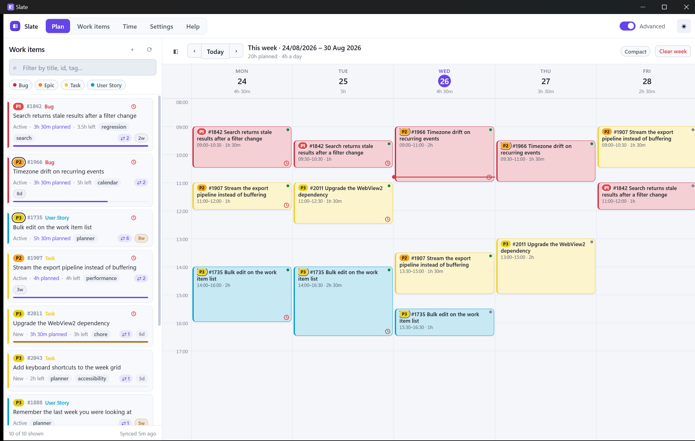

# Slate

A single-executable Windows desktop app that pulls your Azure DevOps work items, lets you block
out time against them on a week grid, and pushes those blocks into your Outlook calendar.


- **.NET 10**, WPF shell hosting a Blazor Hybrid UI in WebView2
- **Dark by default**, with light and system themes and five accent colours
- **One `.exe`** — no installer, no runtime prerequisite, no files beside it
- Talks to Azure DevOps and Microsoft Graph over plain REST, so the whole app is ~66 MB
- **Help tab** with setup steps, how-tos, shortcuts, troubleshooting and version info

---

## Getting it running

```powershell
# build and run from source
dotnet run --project src/Slate

# or produce the standalone executable
./build/publish.ps1              # dist/standalone/Slate.exe  (~66 MB, needs nothing installed)
./build/publish.ps1 -Slim        # dist/slim/Slate.exe        (~29 MB, needs the .NET 10 Desktop Runtime)
```

Requirements: Windows 10 1809+ or Windows 11, x64. The WebView2 runtime is needed and already
ships with Windows 11 and with Edge on Windows 10.

The in-app **Help** tab covers all of the below, plus keyboard shortcuts and troubleshooting.


To regenerate the application icon after changing the mark, run `build/makeicon.ps1`.

On first launch the app opens on **Settings**, because it needs a couple of things from you.


> The Settings screenshot predates the single **Connect** card and the removal of the Save button.

---

## Setup, once

Settings save as you go — there is no Save button to remember.

### 1. Connect

One **Sign in with Microsoft** at the top of Settings connects both halves: it authenticates,
checks Azure DevOps answers, and loads your projects and calendars in the same step. Signing in
and separately remembering to test the other side was the bit people left half done.

You still need an app registration for the client ID (the card walks you through it), and a
personal access token remains available under *Use a personal access token instead* for anyone who
cannot have one — a token reaches Azure DevOps only, so Outlook still wants the Microsoft sign-in.

### 2. Azure DevOps details

Your **organization URL** (for example `https://dev.azure.com/contoso`) goes in the Connect card,
and Microsoft sign-in covers Azure DevOps as well as Outlook — the app registration needs the
`Azure DevOps → user_impersonation` delegated permission for that.

If you would rather use a **personal access token**, it is under *Use a personal access token
instead*: in Azure DevOps go to *User settings → Personal access tokens → New Token* with the
**Work Items (Read & Write)** scope — write is what lets you record time. It is stored encrypted
with Windows DPAPI under your user account, so nobody else on the machine can read it.

Optionally choose a **project**; leaving it blank queries across everything you can see.

Then choose which work items appear: *assigned to me* (with finished states filtered out), *an
area of the project*, a
**saved query** from your Queries hub, or your own **WIQL**.

### 3. Outlook, via an Entra ID app registration

The app writes to your calendar through Microsoft Graph, which needs a client ID you own. It takes
about two minutes:

1. Azure portal → **Microsoft Entra ID** → **App registrations** → **New registration**.
2. Name it anything (`Slate`), and pick the account types that match your organisation.
3. Under **Redirect URI**, choose **Public client/native (mobile & desktop)** and enter
   `http://localhost`.
4. Register, then copy the **Application (client) ID** and **Directory (tenant) ID** into Settings.
5. **API permissions** → **Add a permission** → **Microsoft Graph** → **Delegated** → add
   `User.Read` and `Calendars.ReadWrite`.
6. Only if you chose Microsoft sign-in for Azure DevOps: **Add a permission** →
   **APIs my organization uses** → **Azure DevOps** → `user_impersonation`.
7. **Authentication** → set **Allow public client flows** to **Yes**.

Press **Sign in with Microsoft**. A browser window opens, you consent once, and the token is cached
encrypted on disk so you do not have to do it again.

Then pick the **target calendar** and how events should look — subject template, busy/tentative,
reminder, category, private, and whether to include a link back to the work item.

---

## Two modes, and an optional half

A switch in the header flips between **Basic** and **Advanced**.

**Basic** is read-only against Azure DevOps. It lists your work items, lets you plan time
against them, and moves, resizes, copies and deletes those blocks — and the only thing it
writes is your own plan. No time recording, no raising work items, no comments, no editing, no
touching the team's priority. One rule, so what is missing is predictable rather than a list to
memorise. Your own triage priority still works: that never leaves the machine either.

**Advanced** is the whole app, and is the default.

Separately, **the Outlook half only appears once an Entra ID application is configured.** With no
client ID set, Slate is a standalone planner: work items on the left, your own week on the right,
stored locally. Nothing about sending, syncing, busy overlays or signing in is shown, because none
of it could work — and the settings that depend on a calendar are hidden with it. Add a client ID
and sign in and the whole Outlook side appears, already knowing about every block you have planned.

That means Slate is useful before you have talked to whoever administers your tenant, which is
often the slowest part of getting started.

## Using it

The **Plan** tab is a week grid with your work items down the left.

| Action | How |
| --- | --- |
| Book time | Drag a work item from the sidebar onto a slot |
| Book automatically | Press <kbd>Enter</kbd> on a card, or **Schedule…** — next free slot, or pick a time yourself |
| Move a block | Drag it |
| Copy a block | <kbd>Ctrl</kbd> + drag it |
| Resize | Drag the bottom edge |
| Edit one | Right-click a block → **Edit block** for length presets, notes, and per-block actions |
| Push to Outlook | Happens on its own a few seconds after you stop editing; the header says where it is up to |
| See a work item | Click it anywhere — sidebar, calendar block, or table — for the full record in a scrollable modal |
| More actions | Right-click a calendar block: record time, edit, duplicate, send, delete |
| Record time | Right-click a block → **Record time…**, or the button in the inspector — with an optional note that posts to the discussion |
| Undo recorded time | Right-click the same block → **Undo recorded time**, or Undo in the Time tab |
| Set a priority | Right-click a work item or block → **Your triage** stays here, **Azure DevOps** writes back |
| Change the status | Open the work item and pick a state, or set one while recording time |
| Raise new work | **New work item** on the Work items tab, or **＋** above the Plan sidebar |
| Rename one | Open it and click the pencil beside the title (items assigned to you) |
| Mention a colleague | Type `@` in the comment box |
| Sort the table | Click a column header; click it again to reverse |
| Follow a link | Right-click → pick any **linked work item** to jump to it |
| Discuss it | Open a work item and add a comment — it posts straight to Azure DevOps |
| See how it connects | In the work item, switch **Links** from List to **Map** |

New blocks default to whatever is left on the work item's *Remaining Work* estimate, rounded to the
grid and capped at four hours. The sidebar shows a progress bar per item so you can see what is
still unplanned, and each day header shows its total.

Clicking a work item opens its full record — description, repro steps, acceptance criteria, every
field and its links — in a scrollable modal, so you rarely need the browser.


**Shortcuts:** <kbd>←</kbd>/<kbd>→</kbd> change week · <kbd>T</kbd> today · <kbd>R</kbd> reload work
items · <kbd>Ctrl</kbd>+<kbd>S</kbd> send to Outlook · <kbd>Del</kbd> delete the selected block ·
<kbd>Esc</kbd> deselect · <kbd>/</kbd> focus the filter.

---

## Your existing calendar

Everything already in your Outlook calendar for the visible week is drawn behind the plan in grey,
so you can see what the week really looks like before you commit time to anything.

**Work is not planned on top of it.** Dragging over an occupied slot shows the preview in red and
refuses the drop, and auto-scheduling skips those times. Turn off *Never plan over existing events*
in Settings if you would rather be allowed to double-book.

## How syncing works

Changes go to Outlook **on their own**, a few seconds after you stop editing — long enough that
rearranging a week is one write per block rather than a burst per nudge. The header carries the
state rather than a button: *In Outlook* when everything matches, *N to send* while the wait is
running, and *Retry* if something did not get through, which is also the way to try again. A
failed push never retries itself on a timer; the next edit or that Retry does it, so a calendar
refusing writes cannot turn into a loop.

Turn **Update Outlook automatically as I plan** off in Settings and the **Send to Outlook** button
comes back, for anyone who would rather decide when it happens.


Syncing is two-way for the week on screen.

- **Slate → Outlook.** Each block tracks the event it created plus a fingerprint of what was sent,
  so changing the time, length, title or notes marks it as needing a re-send. **Send to Outlook**
  pushes everything pending.
- **Outlook → Slate.** Move or resize one of these events in Outlook and the block follows on the
  next refresh (every 5 minutes by default, configurable, and on every week change). A block with
  unsent local edits is left alone — your local edit wins until you send it.
- **Deleted in Outlook.** The block is flagged rather than silently removed or silently recreated.
  Right-click it (or open the inspector) to **Remove from plan** or **Send it again**.
- Events created here carry a private extended property, which is how the app tells its own
  bookings apart from the rest of your calendar.
- **Unlink** drops a block from the plan but leaves its Outlook event alone.

## Recording time

Right-click a calendar block and choose **Record time…** on any work item that carries the
scheduling fields (Tasks and Bugs in the stock process templates, plus anything already using
Remaining/Completed Work).

The dialog prefills the length of the block. Saving writes straight to Azure DevOps: **Completed
Work** goes up and, unless you turn it off, **Remaining Work** comes down by the same amount. The
update carries a revision test, so a concurrent edit by someone else fails loudly rather than being
silently overwritten.

Blocks with time booked against them get a red clock, and so does the work item in the sidebar and
in the table.

The dialog also offers the work item's **status**, so finishing a piece of work and saying so are
one step rather than two. It defaults to leaving the state alone, and is applied after the hours
land — and only if they do, so a refused transition never costs you the booking.

The dialog also takes an optional **note**, which is posted to the work item's **discussion** in
Azure DevOps — Plain or Markdown, the same picker the comment box uses, remembering whichever you
used last. Leave it empty and nothing is posted. The hours are the point of the operation and are
already written by the time the note goes out, so a discussion that refuses the note says so and
leaves the booking standing rather than unwinding a good write over a failed extra. Undoing the
entry later takes the hours back off the work item but does not retract the comment.

### The Time tab

Every booking becomes an entry on the **Time** tab, for the week you are looking at.


- A **week summary** grid reads like a timesheet: one row per work item, one column per day,
  a total per row, a **daily total** along the bottom and the week total in the corner.
- Below it, each entry appears as a greyed ghost of the calendar block it came from — the same
  time range and length, drained of colour — grouped by day, with the note it was booked with
  underneath if there was one.
- **Undo** on any entry takes that exact booking back off the work item in Azure DevOps:
  Completed Work goes down, and Remaining Work back up if it was reduced. The entry only
  disappears locally once the write has actually succeeded.

Undo is also on the calendar block's right-click menu, which reverses the most recent booking
made from that block.

## Types that cannot record time

Some types — Features, Epics, and User Stories in the Agile process — have no Remaining or
Completed Work fields, so hours cannot be booked against them.

Put one on the calendar and the app says so, then offers to **spawn a Task underneath it**. Step
through, adjust the title, add a line about what you are actually doing, and it is created in
Azure DevOps as a child of the original — inheriting area path, iteration and assignee, with
Remaining Work seeded from the length of the block. The calendar block then points at the new
task, so time can be recorded against it.

The block stays put either way. Turn the offer off in Settings, or from the notice itself.

## Working from an area, not just your own list

**An area of the project** lists work from an area path rather than from your own assignments.
Everything beneath the area you pick counts, so choosing a top-level area takes in all of its
sub-areas; leave it empty for the whole project.

**Only work items assigned to me** sits underneath it, on by default. Turn it off to see everything
the team has in that area — useful for picking up someone else's work, or planning around it. The
same *hide these states* filter applies either way, so finished work stays out of the list.

## Your hours

Three separate things, because they are genuinely different:

- **The working day** — when you actually work. A day's load is measured against these hours.
- **Show the full 24 hours** — draws the whole clock rather than only the working day, for on-call
  or shift weeks. It does not change what counts as a full day.
- **Book time from / until** — where **Schedule…** and <kbd>Enter</kbd> are allowed to place work.
  Keep the first hour for catching up by booking from 10:00 while the day still starts at 09:00;
  you can always drag a block there yourself.

## Scheduling a block

**Schedule…** offers two ways in: the **next free slot** — the first gap that fits inside the hours
above, skipping anything already in your calendar — or **pick a time**, for when the work has to go
somewhere particular. Either way you can set how long it runs, starting from whatever is left on
the work item's estimate.

## Working across two machines

Your plan file stays on the machine that wrote it. Your calendar does not, so the calendar is where
a block's identity lives: every event Slate writes carries enough of the block stamped onto the
event itself for any copy of the app to rebuild it. Events also get a **marker** in their subject
(`-Slate-` by default, configurable in Settings), which is a label for your own eyes in Outlook —
recognition does not depend on it, so the two machines need not agree on what it says.

Open Slate on another machine signed in to the same calendar, with **two-way sync** on, and it
picks those blocks up — they appear on the grid and can be moved, resized, re-synced or deleted
there like any other. Blocks are picked up a week at a time, as you navigate to them.

Unlinking a block, or deleting one while *Delete the Outlook event too* is off, leaves the event on
the calendar but tells this machine it has finished with it, so it is not picked straight back up.

## Changing the status

Open a work item and its status sits along the bottom of the window: a coloured pill for the state
it is in, and a **Change to…** dropdown listing everywhere else it could go, in the order its
process template defines them. Pick one and it is written to Azure DevOps straight away.

A pill per state read well enough with four of them and became a wall of colour on a process that
defines a dozen, so only the current one is coloured.

Deliberately only there and in the record-time dialog. The state is what the rest of the team reads
as "where is this up to", so it is not something to change in passing from a list or a right-click
menu — it takes opening the work item, or booking time against it.

Azure DevOps decides which transitions are legal and fills in the matching *Reason* itself. One it
refuses comes back as the error it gave rather than being guessed at here.

Because the state travels in the calendar event, changing it marks that work item's blocks as
needing re-sending, and the next sync updates them in Outlook.

## Priority, two ways

Right-click any work item — card, calendar block, or from the details modal — and you get two
rows of **P1 to P4** pills. Both use the same traffic lights: **P1 red, P2 amber, P3 yellow,
P4 violet**.

**Your triage** is yours alone. It lives in `plan.json` on this machine and never goes back to
Azure DevOps, so you can order your own week without touching what the team sees.

**Azure DevOps** writes to the work item's own priority field. Because everyone can see that one
and it lands in the item's history, it always asks first, showing what the value is now and what
it is about to become.

A pill with a ring around it is your triage; a plain one is Azure DevOps'. Where you have set both
and they disagree, the pill shows yours and the tooltip says what the team sees. Sorting by
priority follows the same rule, and anything with no priority at all sorts last either way round.

## Linked work items

Items that are linked to others carry a `⇄ n` badge at the foot of the card, beside the age
pill, and in the table. Hovering lists
the links; right-clicking shows them by kind — **Parent**, **Child**, **Related**, **Successor**,
**Duplicate of** and so on — and clicking one opens that work item's details, so you can walk a
chain of related items without leaving Slate. The details modal lists the same links, and
Azure DevOps link types are translated into readable names.

Switch that list to **Map** for a diagram of how the item connects: parents above, children below,
everything else to the sides, colour-coded by work item type. Click any card to re-centre the map
on it.

## The work item window

Clicking a work item anywhere opens the whole record, in reading order:

1. **Title** — click the pencil beside it to rename the item, on anything assigned to you.
2. **Description** — with an **Edit** button, again on items assigned to you.
3. **Acceptance criteria, repro steps, system info** and any other rich-text field, including
   custom ones — anything holding markup gets its own section rather than being buried.
4. **Discussion**.
5. **Links**, as a list or a map, sitting between the conversation and the small print.
6. **Metadata** last: state, reason, area, iteration, dates and every remaining field.

Images attached to a work item are fetched with your credential and inlined, so screenshots in a
description or a comment actually appear instead of showing as broken. Pictures hosted anywhere
outside your organization are left for the browser engine to fetch — your token is never sent
off to somebody else's server.

## Discussion

The discussion reads like a conversation: oldest at the top, **newest at the bottom**, threaded,
with your own comments accented. Azure DevOps shows it newest-first; a toggle switches between the
two. The box underneath posts a comment straight to Azure DevOps, so notes do not mean a trip to
the browser.

Type `@` and a name to **mention a colleague**. The list comes from the teams in your project, and
picking someone from it posts a real Azure DevOps mention that notifies them. Typing a name out in
full works just as well — any name the app recognises becomes a mention on the way out. People
it cannot resolve to an identity still read correctly, just without the link, and the picker says
which is which.

## Plain text, Markdown or HTML

The comment box and the description editor both carry a **Plain / Markdown / HTML** switch, and
remember which you chose.

- **Plain** keeps exactly what you typed, line breaks included, and interprets nothing else.
- **Markdown** covers headings, `**bold**`, `*italic*`, `` `code` `` and fenced blocks, bullet and
  numbered lists, quotes, rules, links, images and pipe tables.
- **HTML** passes your markup through as-is, minus scripts and event handlers. It is the default
  for descriptions, because that is what Azure DevOps already stores — so opening one to edit
  shows the real thing rather than a lossy approximation.

Switching a description out of HTML flattens the existing markup to text. The hint under the box
says so before you save, rather than after.

## Raising work

**New work item** on the Work items tab, or the **＋** above the Plan sidebar, raises one in
Azure DevOps without leaving the app. Pick the project and type — both read from your
organization — give it a title, and fill in as much of the rest as you want: a description in
whichever format you prefer, assignee, area and iteration, tags, priority, and an estimate. Tick
**Book the next free slot for it** and it lands on the calendar as soon as it exists.

The **area path** is chosen from the project's own area tree rather than typed: the project root,
then the level below it, then the level below that, each dropdown narrowing the next. Changing a
level clears the ones under it, so you cannot build a path that does not exist, and the value
Azure DevOps will receive is spelled out under the boxes as you go. Where the tree cannot be read
— some tokens can create work items in areas they are not allowed to enumerate — the field falls
back to a plain text box and says why.

Only the project, type and title are needed. An assignee Azure DevOps will not resolve is dropped
rather than being allowed to fail the whole thing — losing a filled-in form to a stale display
name is a poor trade for an item that would have been created unassigned anyway.

## Sorting the table


Every column on the Work items tab sorts: id, type, title, state, priority, age, estimate, planned
and recorded. Clicking the column already in use turns it around, and the little arrow in the
header says which way it is pointing. A column you have not used yet starts in whichever direction
is useful first — newest, largest, or A to Z.

## Age

Every work item carries an **age** pill — days since it was raised — at the bottom right of its
card, and as a sortable **Age** column on the Work items tab. It warms as the item gets older:
grey under a week, darker to a month, amber to three months, red beyond that.

## Staying in step

Work items are re-read from Azure DevOps every **60 seconds** (configurable, zero to turn it off),
quietly — no spinner, no interruption, and never while a manual refresh is running. The calendar
is polled on its own slower schedule. Anything raised or changed by someone else turns up on its
own.

## Keeping up to date

On launch the app asks GitHub once whether there is a newer release. If there is, a yellow bar
appears above the header — the new version number, the one you are on, and a link straight to that
release's page for the download. Dismiss it and it stays gone until the next launch.

The check is deliberately quiet and best-effort: it runs after the first paint so it can never hold
the window up, and no network, a rate limit or a draft release all mean nothing is shown rather
than an error. Nothing is downloaded or installed for you — upgrading is still a matter of swapping
the `.exe`.

## Carrying your setup around

**Export config…** and **Import config…** at the top of Settings write and read a plain JSON file
holding the organization URL, client and tenant IDs, calendar event defaults, working week and
appearance.

The personal access token is **never exported**: it is encrypted to your Windows account and would
be useless elsewhere, and a config file is the sort of thing people email around. Importing keeps
whatever token is already configured, and applies only the sections the file actually contains.

## Appearance

Dark by default. The button in the top right corner cycles dark, light and system, and Settings
carries five accent colours and a compact density for smaller screens.



---

## Where things live

Everything is per-user and local, under `%LOCALAPPDATA%\Slate`. On first run, anything left in
the old `%LOCALAPPDATA%\WorkItemPlanner` folder is copied across — copied, not moved, so the
original is still there if you want it. Set
`SLATE_DATA` to put it somewhere else — a folder on a stick for a portable copy, or
a scratch folder so a second copy can run without disturbing the first:

| File | Contents |
| --- | --- |
| `settings.json` | Configuration. The PAT inside it is DPAPI-encrypted. |
| `plan.json` | Your time allocations, recorded time entries, and local priorities. |
| `msal.cache` | Sign-in token cache, DPAPI-encrypted. |
| `crash.log` | Written only if something goes badly wrong. |

Nothing is sent anywhere except to Azure DevOps and Microsoft Graph.

---

## Layout

```
src/Slate/
  App.xaml.cs                  WPF startup, DI container, crash handling
  MainWindow.xaml              the window; dark title bar; hosts the Blazor view
  appicon.ico                  application icon (exe, window and taskbar), 16-256px
  Components/
    Layout/MainLayout.razor    header, nav, sync button, theme toggle
    Pages/                     Planner (week grid), WorkItems (table), TimeRecorded, Settings, Help
    Shared/                    work item card, allocation inspector, toasts
  Services/
    Auth/                      MSAL public client + DPAPI token cache
    AzureDevOps/               WIQL, saved queries, work item batches
    Graph/                     calendar read/create/update/delete
    Planning/                  AppState, PlannerService, toasts
    Storage/                   settings and plan persistence, DPAPI helper
    EmbeddedWebAssets.cs       serves wwwroot from inside the .exe
  wwwroot/                     CSS design tokens and interop JS
build/publish.ps1              single-file publish
```

The REST clients are hand-written rather than using the Azure DevOps and Graph SDKs — those would
have added tens of megabytes to the executable for a handful of endpoints.

One thing worth knowing before you touch the calendar UI: **dragging is built on pointer events, not
HTML5 drag-and-drop**. WebView2's composition hosting fires `dragstart` and then cancels the drag
immediately, so `dragover` and `drop` never arrive and nothing can be dropped. `wwwroot/js/planner.js`
runs the whole gesture — threshold, ghost, slot hit-testing, edge scrolling — and calls back into
`Planner.razor` on release. Adding `draggable="true"` to anything in the grid will break it again.
